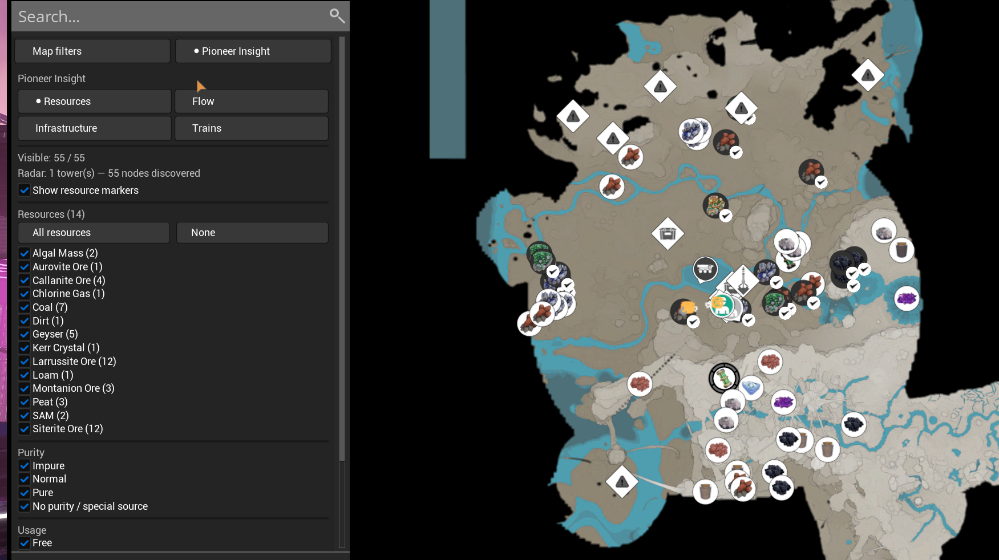
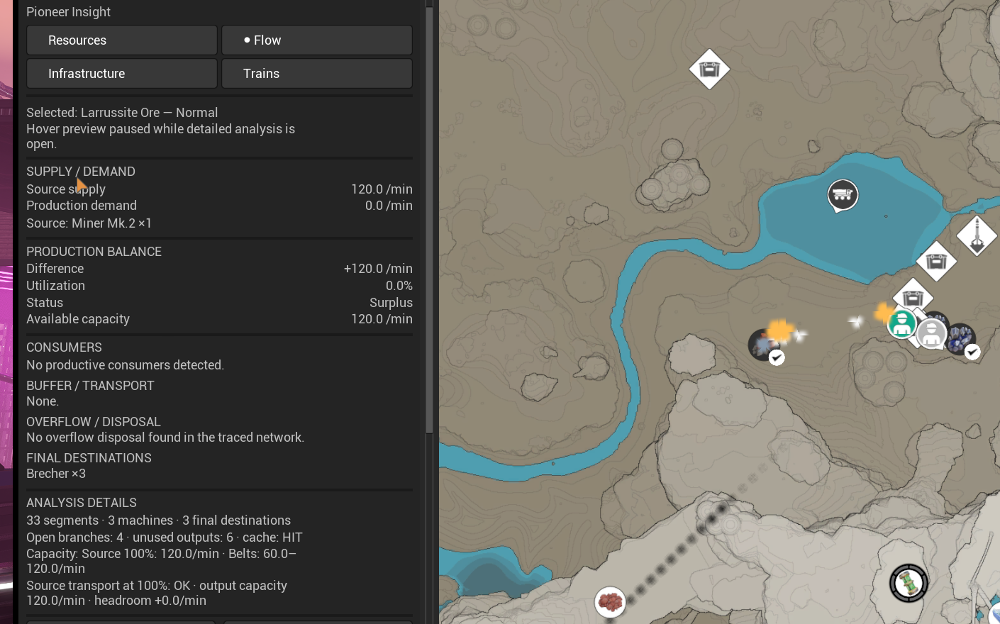
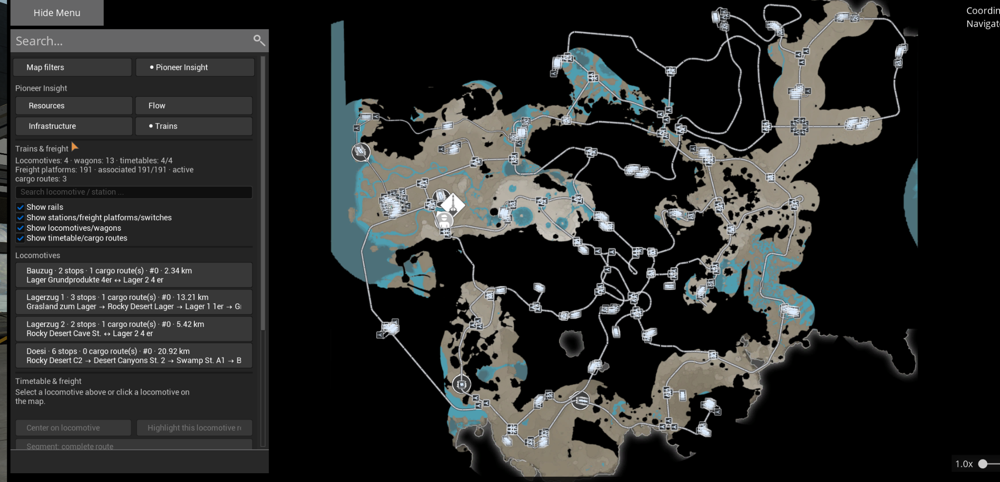
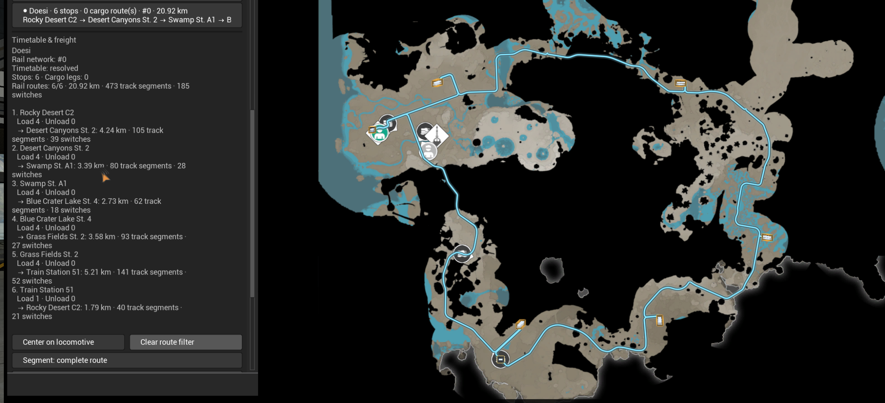

# Pioneer Insight

> Entdecke Ressourcen, analysiere Materialflüsse und verstehe deine vollständige Fabrikinfrastruktur direkt auf der Satisfactory-Karte.

[English](README.md)

[](screenshots/Insightresources.png)

Pioneer Insight verwandelt die Spielkarte in eine umfangreiche Fabrik- und Infrastrukturübersicht. Finde per Radar entdeckte Ressourcen, prüfe Produktionsangebot und -bedarf, untersuche Transportnetze und verfolge vollständige Zug- und Frachtrouten, ohne zu einem externen Werkzeug wechseln zu müssen.

Vanilla wird unterstützt. Ficsit Farming, Satisfactory Plus und kompatible Ressourcen-Mods sind optionale Integrationen und keine erforderlichen Abhängigkeiten.

## Neu in 1.0.0

- **Radarbasierte Ressourcenanzeige.** Zeigt tatsächlich entdeckte Ressourcen-Nodes und filtert sie nach Typ, Reinheit, Nutzung und Inhaltsquelle.
- **Materialflussanalyse.** Analysiert Quellenleistung, produktiven Bedarf, Auslastung, Überschuss, Defizit, freie Kapazität, Verbraucher, Puffer und Endziele.
- **Infrastrukturübersicht.** Zeigt Produktionsgebäude, Förderbänder, Rohre, Bahnhöfe, Frachtplattformen, Weichen und zusammenhängende Schienennetze auf der Karte.
- **Zug- und Frachtanalyse.** Durchsuche Lokomotiven, Waggons, Fahrpläne, Halte und Frachtrouten und hebe anschließend die vollständige physische Route eines Zuges hervor.
- **Serverautorisierter Multiplayer.** Dedicated Server liefern verbindliche Ressourcen-, Zug- und Schienendaten, damit die Sichtweite des Clients keine wichtigen Daten ausblendet.
- **Leistung bei großen Netzen.** Zugdaten werden zuerst geladen; das komprimierte vollständige Schienennetz folgt im Hintergrund und bleibt beim erneuten Öffnen der Karte im Cache.

## Vier integrierte Kartenansichten

### Ressourcen

Pioneer Insight ergänzt neben den normalen Kartenfiltern eine eigene Ressourcenansicht. Sie zeigt nur Nodes, die durch das Radarsystem des Spiels entdeckt wurden, und erstellt dynamische Filter für jede erkannte Ressource.

Filtere nach Ressourcentyp, Reinheit, frei oder belegt sowie nach Inhaltsquelle. Mod-Ressourcen werden automatisch ergänzt, wenn kompatible Laufzeitdaten verfügbar sind. Dazu gehören auch Nodes in getrennt gestreamten Welten wie den Ressourcen-Leveln von Ficsit Farming.

### Materialfluss

Fahre mit der Maus über einen Ressourcen-Node oder wähle ihn aus, um das verbundene Produktionsnetz zu untersuchen. Die Analyse trennt Quellenleistung und produktiven Bedarf und zeigt daraus Bilanz, Auslastung und verbleibende Kapazität.

Verbraucher, Puffer, Transportgebäude, Überlaufentsorgung und Endziele werden getrennt aufgeführt. Weitere Diagnosen umfassen Maschinenzahlen, Netzwerksegmente, offene Zweige, ungenutzte Ausgänge, Förderbandkapazitäten und erkannte Engpässe am Ausgang der Quelle.

Pioneer Insight analysiert deine bestehende Fabrik. Rezepte, Taktungen und Logistik werden nicht verändert.

### Infrastruktur

Die Infrastrukturansicht zeigt, wie eine große Fabrik verbunden ist. Produktionsgebäude, Splitter, Merger, Förderbänder, Rohre, Bahnhöfe, Frachtplattformen, Weichen und Schienenfahrzeuge können direkt auf der Karte untersucht werden.

Suche und Netzwerkfilter helfen dabei, nur den aktuell benötigten Fabrikbereich anzuzeigen, statt alle Diagnoseebenen gleichzeitig einzublenden.

### Züge und Fracht

Die Zugansicht zeigt Lokomotiv- und Waggonzahlen, erkannte Fahrpläne, Bahnhofsreihenfolgen, Frachtabschnitte und Streckenlängen. Wähle eine Lokomotive aus, um ihren vollständigen Fahrplan zu prüfen oder ihren tatsächlichen Weg durch das Schienennetz hervorzuheben.

Für jeden Streckenabschnitt können Distanz, durchfahrene Schienensegmente und Weichenanzahl angezeigt werden. Die Karte kann außerdem auf die ausgewählte Lokomotive zentriert werden.

## Funktionen

- Eigene Seiten für Ressourcen, Materialfluss, Infrastruktur und Züge innerhalb der normalen Karte.
- Dynamische Filter für Vanilla- und kompatible Mod-Ressourcen.
- Filter für Reinheit sowie freie und belegte Ressourcen-Nodes.
- Sichtbarkeit entsprechend der Radarentdeckung.
- Materialflussanalyse für feste und flüssige Ressourcen.
- Kennzahlen für Angebot, Bedarf, Auslastung, Überschuss, Defizit und freie Kapazität.
- Getrennte Übersichten für Verbraucher, Puffer/Transport, Überlauf/Entsorgung und Endziele.
- Kapazitätsdiagnosen für Förderbänder und Quelltransport.
- Infrastruktursuche, Auswahl und Isolierung zusammenhängender Netze.
- Darstellung des vollständigen serverseitigen Schienennetzes.
- Übersicht über Lokomotiven, Waggons, Fahrpläne, Bahnhöfe und Frachtplattformen.
- Physische Hervorhebung von Fahrplanrouten über die tatsächlichen Gleise.
- Serverautorisierte Multiplayer-Synchronisierung.
- Deutsche und englische Oberfläche entsprechend der Spielsprache.

## Screenshots

### Ressourcen

[](screenshots/Insightresources.png)

### Materialfluss und Produktionsbilanz

[](screenshots/Insightflow.png)

### Vollständige Schienennetzübersicht

[](screenshots/Insighttrains.png)

### Hervorgehobene physische Zugroute

[](screenshots/Trainsroutshighlight.png)

Die Screenshots können optionale Mod-Inhalte und einen weit entwickelten Spielstand mit großem Schienennetz enthalten.

## Erste Schritte

1. Installiere Pioneer Insight über den Satisfactory Mod Manager.
2. Installiere im Multiplayer dieselbe Version auf Client und Dedicated Server.
3. Lade deinen Spielstand und öffne die normale Karte im Spiel.
4. Wähle **Pioneer Insight** und danach **Ressourcen**, **Materialfluss**, **Infrastruktur** oder **Züge**.

Die Sichtbarkeit von Ressourcen folgt dem Radarstatus des Spiels. Pioneer Insight deckt keine unentdeckten Nodes auf.

## Kompatibilität

| Komponente | Unterstützung |
| --- | --- |
| Satisfactory | Spielversion `>=502094` |
| Satisfactory Mod Loader | `^3.12.0` erforderlich |
| Vanilla | Unterstützt |
| Kompatible Ressourcen-Mods | Dynamische Laufzeiterkennung |
| Ficsit Farming | Optionale Ressourcen-Node-Integration |
| Satisfactory Plus | Optionale Ressourcen- und Fabrikintegration |
| Multiplayer | Unterstützt |
| Dedicated Server | Unterstützt; gleiche Version auf Server und Clients empfohlen |
| Oberfläche | Deutsch und Englisch |

Optionale Inhalte erscheinen nur, wenn die jeweilige Mod und die benötigten Laufzeitdaten verfügbar sind. Die dynamische Erkennung garantiert keine Unterstützung für jedes Gebäude und jede Ressource aus jeder Mod.

## Multiplayer- und Leistungshinweise

Auf Dedicated Servern fordert Pioneer Insight verbindliche Ressourcen-, Zug- und Schienendaten an. Die Zugmetadaten werden zuerst übertragen, damit Lokomotiven und Fahrpläne verfügbar sind, bevor das vollständige statische Schienennetz fertig geladen wurde.

Die vollständige Schienengeometrie wird komprimiert, im Hintergrund übertragen und anschließend zwischengespeichert. Beim erneuten Öffnen der Karte oder Wechseln der Registerkarte werden unveränderte Gleise nicht neu aufgebaut. Lokale Client-Kopien werden nach Erhalt der Serverdaten unterdrückt, damit keine doppelten Züge, Fahrpläne oder Schienensegmente entstehen.

Beim Verlassen oder Wechseln der Spielwelt wird der Cache zurückgesetzt; er wird nicht dauerhaft zwischen Spielsitzungen gespeichert.

## Diagnose und Fehlermeldungen

Melde reproduzierbare Fehler und Funktionswünsche über [GitHub Issues](https://github.com/DerDoesewicht/PioneerInsight/issues).

Bitte gib Folgendes an:

- Spielversion, SML-Version und Pioneer-Insight-Version.
- Einzelspieler, Multiplayer-Client oder Dedicated Server.
- Installierte Inhalts- und Ressourcen-Mods.
- Schritte zum Nachstellen und Screenshots.
- Relevantes Client-/Server-Log oder Absturzbericht.
- Einen passenden Diagnoseexport, falls dieser angefordert wird.

Verfügbare Diagnosebefehle:

```text
PioneerInsight.Perf
PioneerInsight.ProbeRadar
PioneerInsight.ProbeInfrastructure
PioneerInsight.ProbeTrains
```

Discord: `derdoesewicht`

## Mod-Identität

- Öffentlicher Name: **Pioneer Insight**
- Technische Mod-Referenz: `PioneerCartographer`
- Aktueller Release: **1.0.0**

Die technische Mod-Referenz bleibt absichtlich `PioneerCartographer`, damit bestehende Installationen, Spielstände und Multiplayer-Sitzungen kompatibel bleiben.

Dieses Projekt ist weder mit Coffee Stain Studios verbunden noch wird es von Coffee Stain Studios unterstützt.
